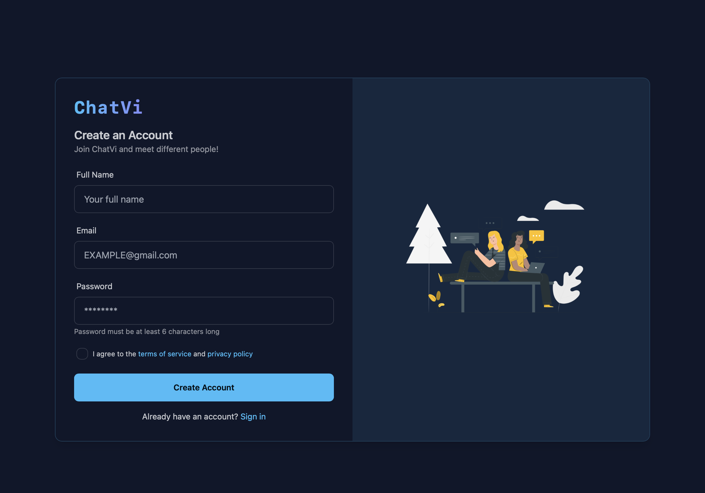
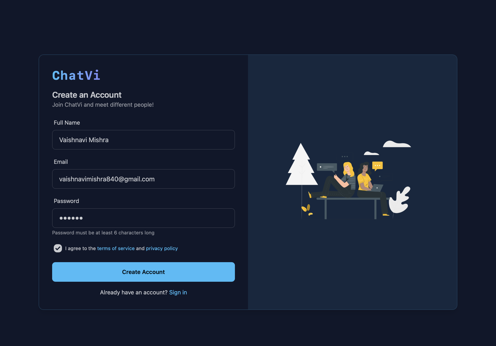
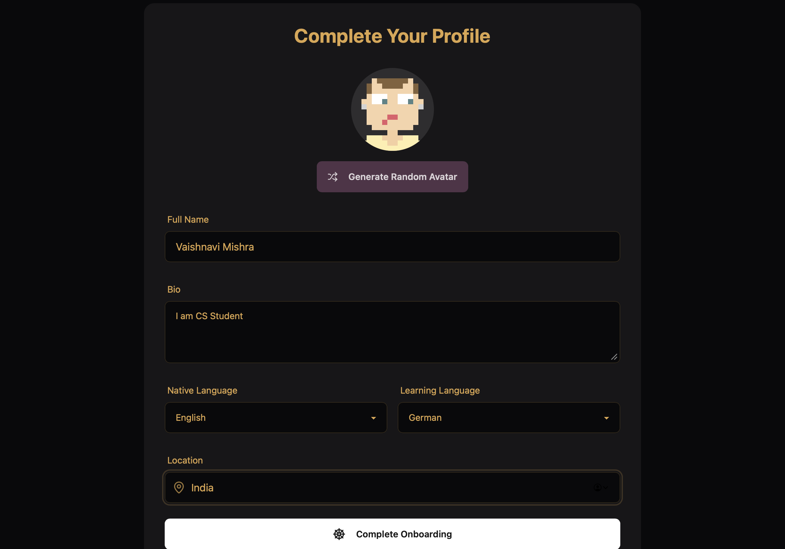
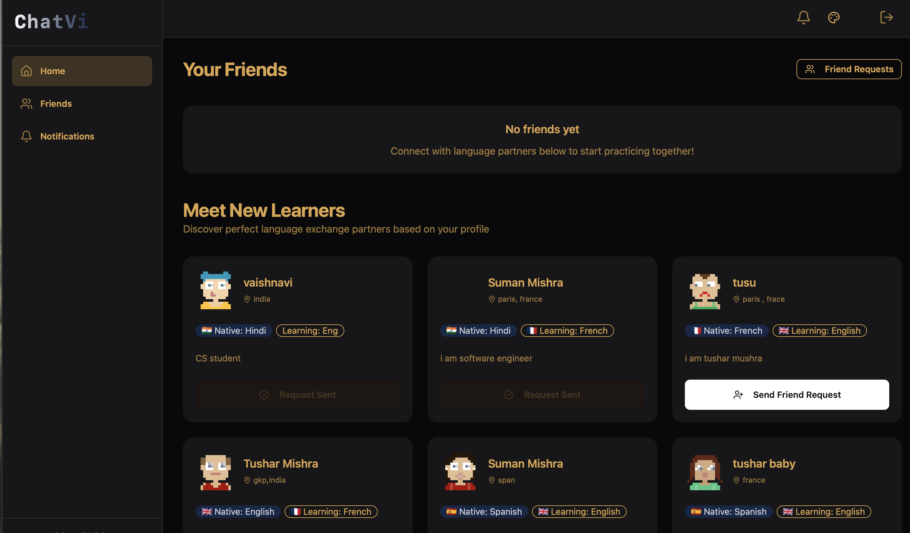
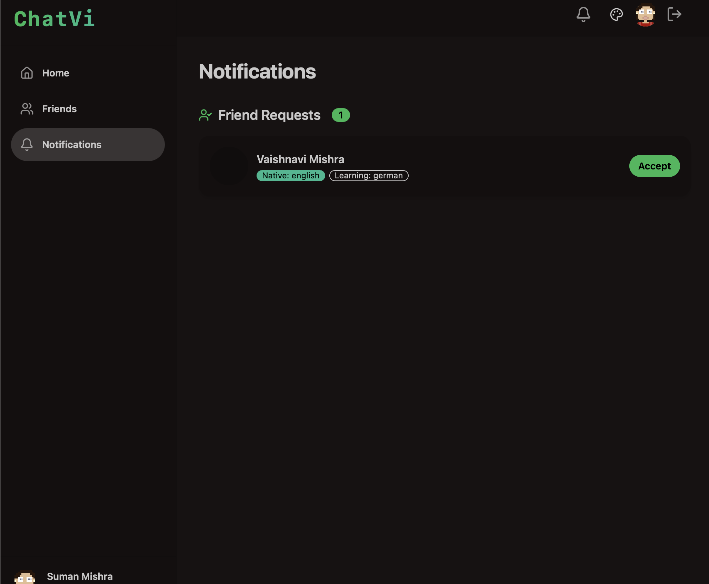
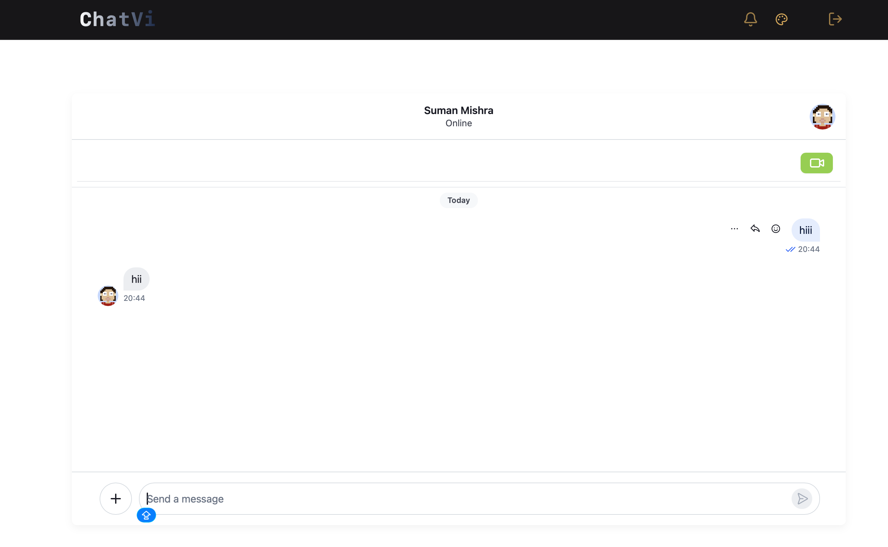
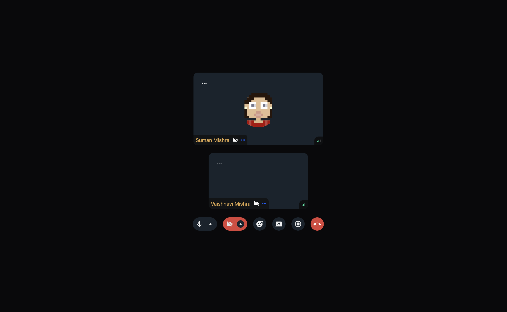

#  ChatVi

A modern language exchange platform that helps users connect with language partners worldwide through real-time messaging and video calling.

---

## ✨ Features

### 🔐 Authentication
- User Signup
- User Login
- Protected Routes
- JWT Authentication

### 👤 User Onboarding
- Complete Profile Setup
- Profile Picture Selection
- Native Language Selection
- Learning Language Selection
- Bio & Location Management

### 🤝 Social Features
- Send Friend Requests
- Accept Friend Requests
- Notifications System
- Language Partner Discovery

### 💬 Real-Time Chat
- One-to-One Messaging
- Real-Time Updates
- Chat History
- Stream Chat Integration

### 📹 Video Calling
- Real-Time Video Calls
- Call Link Sharing Through Chat
- Stream Video SDK Integration

### 🎨 Modern UI
- Responsive Design
- Theme Switching
- Clean User Experience
- DaisyUI + Tailwind CSS

---

## 📸 Application Screenshots

### Login & Signup

<p align="center">
  
  
</p>

### Profile Onboarding & Home Page

<p align="center">
  
  
</p>

### Notifications & Chat

<p align="center">
  
  
</p>

### Video Calling

<p align="center">
  
</p>

---

## 🏗️ System Architecture

```text
React + Vite Frontend
          │
          ▼
Node.js + Express Backend
          │
          ▼
        MongoDB
          │
          ▼
Stream Chat API
          │
          ▼
Stream Video SDK
```

---

## 🛠️ Tech Stack

### Frontend
- React.js
- Vite
- React Router
- TanStack Query
- Tailwind CSS
- DaisyUI
- Zustand
- Axios
- Stream Chat React SDK
- Stream Video React SDK

### Backend
- Node.js
- Express.js
- MongoDB
- Mongoose
- JWT Authentication

---

## 📂 Project Structure

```text
ChatVi
│
├── frontend
│   ├── src
│   │   ├── components
│   │   ├── pages
│   │   ├── hooks
│   │   ├── store
│   │   ├── constants
│   │   └── lib
│   │
│   └── public
│
├── backend
│   ├── controllers
│   ├── models
│   ├── routes
│   ├── middleware
│   ├── lib
│   └── server.js
│
└── screenshots
```

---

## 🚀 Installation

### Clone Repository

```bash
git clone https://github.com/your-username/streamify.git
cd ChatVi
```

### Frontend Setup

```bash
cd frontend
npm install
npm run dev
```

### Backend Setup

```bash
cd backend
npm install
npm run dev
```

---

## 🔑 Environment Variables

### Frontend (.env)

```env
VITE_STREAM_API_KEY=your_stream_api_key
```

### Backend (.env)

```env
PORT=5001

MONGO_URI=your_mongodb_connection_string

JWT_SECRET=your_jwt_secret

STREAM_API_KEY=your_stream_api_key
STREAM_API_SECRET=your_stream_api_secret
```


## 🔮 Future Enhancements

- Group Chats
- Voice Calls
- File Sharing
- Message Reactions
- Online Presence Indicator
- AI-Based Language Partner Recommendations
- AI Translation Support

---

## 👩‍💻 Author

**Vaishnavi Mishra**

B.Tech Student | Full Stack Developer

